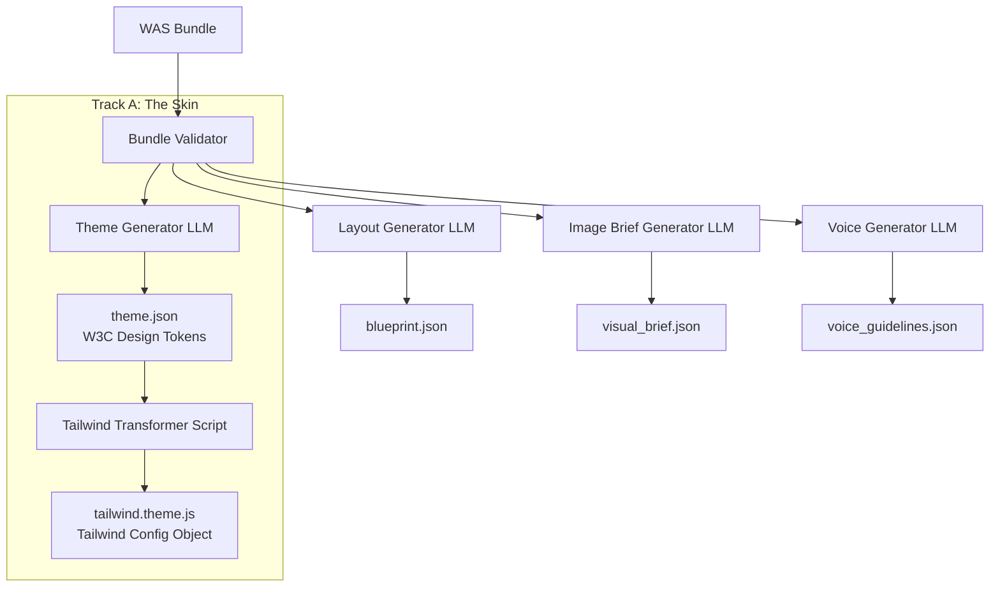

# Phase 03 — The Second Link (WAS → Industry Specs)

**Status:** Planned
**Prerequisites:**
*   Phase 02 complete.
*   **CRITICAL: Phase 02 Hardening (Task Groups 2.8, 2.9, 2.10, and 2.11) complete.** This ensures all foundational data models, shared types, and validation logic are stable before building the translation layers that depend on them.
**Previous Phase:** [Phase 02 - Tooling](phase_02_tooling.md)
**Timeline:** TBD

---

## 1. Goal

Phase 02 delivered the ability to translate **user intent → WAS bundles**.

Phase 03 builds the **second link**: translating **WAS bundles → industry-standard specifications** that developers and design tools can actually use.

**Core Question:** How do we go from aesthetic intent (WAS) to implementation specs (theme.json, layout blueprints)?

---

## 2. Problem Statement

The WAS Bundle is a **semantic representation** of aesthetic intent. But developers and tools need:
- **Design Tokens** (`theme.json`, CSS variables) - The Skin
- **Layout Blueprints** (Component hierarchies, spacing rules) - The Skeleton
- **Visual Briefs** (Image generation parameters) - The Imagery
- **Voice Guidelines** (Copy tone, messaging rules) - The Copy

Phase 03 builds the **translation layer** from WAS to these concrete specifications.

---

## 3. Core Deliverables

### Track A: The Skin (Theme Specification)

**Goal:** WAS Visual Traits (L3) → Design Tokens

**Deliverables:**
- [ ] **1. W3C Design Tokens Generator:**
    - [ ] Research and document the target `theme.json` schema based on the W3C Design Tokens format.
    - [ ] Build a system prompt for the LLM to translate a WAS Bundle into a valid `theme.json` file.
    - [ ] Implement a validator for the generated `theme.json` output to ensure compliance.
- [ ] **2. Tailwind Theme Transformer:**
    - [ ] Create a script (`tooling/src/transformers/tokens-to-tailwind.ts`) that reads a `theme.json` file.
    - [ ] This script will deterministically convert the standard token format into a JavaScript object compatible with `tailwind.config.js`.
- [ ] **Testing and Validation:**
    - [ ] Test that the same WAS bundle consistently produces the same `theme.json`.
    - [ ] Verify that the generated Tailwind theme object correctly reflects the values from the `theme.json`.

**Example Mapping:**
```
WAS Bundle:
  layer3_lexicon:
    palette_trait: "duotone_palette"
    surface_texture: "glass_panel"

→ Theme JSON:
  colors.primary: "#667eea"
  colors.secondary: "#764ba2"
  effects.glassmorphism: "backdrop-blur(10px)"
```

**Constraints:**
- Translation must be **deterministic** (same WAS → same tokens)
- Must not "add creativity" - only interpret existing WAS data
- Token values must follow W3C Design Tokens spec

---

### Track B: The Skeleton (Layout Blueprint)

**Goal:** User Context + WAS → Page Layout Structure

**Deliverables:**
- [ ] Research layout systems (DivKit, Beagle, Relume)
- [ ] Define hybrid blueprint schema
- [ ] Create component registry (Hero, Navbar, Cards, etc.)
- [ ] Build system prompt for layout generation
- [ ] Test density variations (airy vs maximal)

**Example Blueprint:**
```json
{
  "page_type": "landing",
  "sections": [
    {
      "component": "hero",
      "density": "balanced",
      "spacing": "comfortable"
    },
    {
      "component": "feature_grid",
      "columns": 3,
      "gap": "relaxed"
    }
  ]
}
```

**Key Decision:** Blueprint should be **layout-agnostic** (not tied to specific frameworks)

---

### Track C: Visual Briefs (Imagery)

**Goal:** WAS + Content Context → Image Generation Parameters

**Deliverables:**
- [ ] Define `visual_brief.json` schema
- [ ] Map WAS layers to image generation parameters
- [ ] Build system prompt for brief generation
- [ ] Test with Midjourney/DALL-E/Stable Diffusion

**Example Brief:**
```json
{
  "style": "minimalist photography",
  "mood": "serious, premium",
  "lighting": "natural, soft shadows",
  "color_palette": "muted earth tones",
  "composition": "centered, spacious"
}
```

---

### Track D: Voice Guidelines (Copy)

**Goal:** WAS Tone + Brand Context → Content Guidance

**Deliverables:**
- [ ] Define `voice_guidelines.json` schema
- [ ] Map tone axes to writing style
- [ ] Build system prompt for guideline generation
- [ ] Test with sample copy generation

**Example Guidelines:**
```json
{
  "tone": "serious but approachable",
  "sentence_structure": "clear and direct",
  "vocabulary": "professional without jargon",
  "formality": "semiformal"
}
```

---

## 4. Architecture



---

## 5. Implementation Plan

### 5.1 Track A: Theme Spec (Priority 1)

**Week 1-2:**
- [ ] Research W3C Design Tokens spec
- [ ] Document target schema
- [ ] Map L3 lexicon terms to token types

**Week 3-4:**
- [ ] Build theme generator system prompt
- [ ] Implement token value calculation
- [ ] Test determinism

**Week 5:**
- [ ] Validate against real theme.json files
- [ ] Document mapping rules
- [ ] Integration testing

### 5.2 Track B: Layout Blueprint (Priority 2)

**Week 1-2:**
- [ ] Analyze existing layout systems
- [ ] Define component registry
- [ ] Create blueprint schema

**Week 3-4:**
- [ ] Build layout generator prompt
- [ ] Test density variations
- [ ] Validate output structure

### 5.3 Tracks C & D: Briefs (Priority 3)

**Week 1-2:**
- [ ] Define brief schemas
- [ ] Map WAS to parameters
- [ ] Build generator prompts

**Week 3:**
- [ ] Test with actual tools
- [ ] Validate output quality
- [ ] Document workflows

---

## 6. Success Criteria

Phase 03 is complete when:

1. **Theme Generator Works:**
   - [ ] Given a WAS bundle → produces valid theme.json
   - [ ] Same bundle → same tokens (deterministic)
   - [ ] Tokens follow W3C spec

2. **Layout Generator Works:**
   - [ ] Given WAS + context → produces blueprint
   - [ ] Blueprint is framework-agnostic
   - [ ] Density variations work correctly

3. **Briefs Work:**
   - [ ] Visual briefs generate appropriate parameters
   - [ ] Voice guidelines match tone axes

4. **Integration:**
   - [ ] Can generate all specs from one WAS bundle
   - [ ] Specs are internally consistent
   - [ ] Documented for developer use

---

## 7. Dependencies

### 7.1 From Phase 02
- ✅ WAS Bundle structure defined
- ✅ Orchestrator generates bundles
- ⚠️ **Bundle validator** (CRITICAL - must complete first)
- ⚠️ TOML/JSON converters

### 7.2 External Research
- [ ] W3C Design Tokens specification
- [ ] DivKit/Beagle documentation
- [ ] Relume component library analysis
- [ ] Image generation API documentation

### 7.3 Validation Data
- [ ] Sample theme.json files from real projects
- [ ] Example layouts for comparison
- [ ] Test WAS bundles with known expected outputs

---

## 8. Risks & Mitigations

| Risk | Impact | Mitigation |
|------|--------|------------|
| **No standard for blueprints** | Hard to validate | Create our own spec, document thoroughly |
| **Token values subjective** | Inconsistent output | Use lookup tables, constrain ranges |
| **Determinism hard to achieve** | Different outputs each time | Lock down randomness, use strict rules |
| **Spec drift over time** | Breaking changes | Version specs, maintain backwards compatibility |

---

## 9. Open Questions

1. **Token Value Ranges:** How do we determine exact color/spacing values from L3 terms?
2. **Blueprint Flexibility:** How much layout freedom vs strict interpretation?
3. **Component Naming:** Follow DivKit, Relume, or create our own?
4. **Multi-track coordination:** How do theme + layout stay consistent?

---

## 10. Deliverables Checklist

**Track A: Theme Spec**
- [ ] `schema/theme_spec_schema.toml`
- [ ] `prompts/theme_generator_prompt.md`
- [ ] `tooling/src/generators/generate_theme.ts`
- [ ] Validator for theme.json
- [ ] Test suite (10+ bundles)
- [ ] Documentation

**Track B: Layout Blueprint**
- [ ] `schema/blueprint_schema.toml`
- [ ] `data/component_registry.toml`
- [ ] `prompts/layout_generator_prompt.md`
- [ ] `tooling/src/generators/generate_blueprint.ts`
- [ ] Test suite
- [ ] Documentation

**Tracks C & D: Briefs**
- [ ] Brief schemas
- [ ] Generator prompts
- [ ] Test examples
- [ ] Documentation

---

**Next Phase:** Phase 04 - Productionise (Full web deployment, visualizers)

**Related Documents:**
- [Phase 02 - Tooling](phase_02_tooling.md)
- [Phase 01 - Foundations](phase_01_foundations.md)
- [Validation Rules](../../playbooks/VALIDATION_RULES.md)
