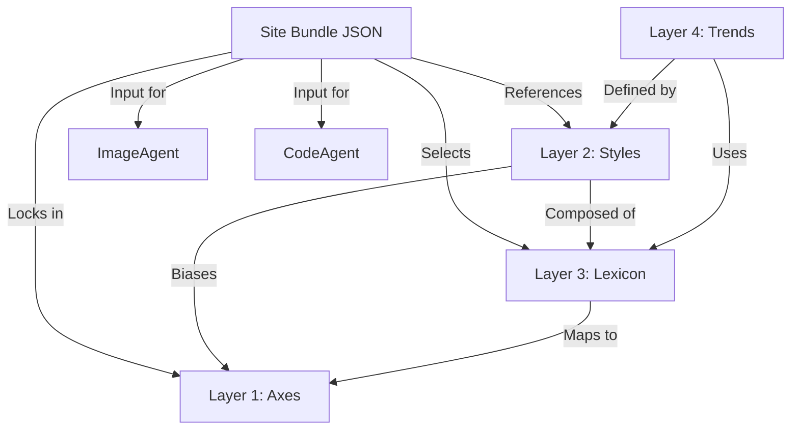

# Website Aesthetic Schema (WAS) — Masterplan

**Version:** 0.2  
**Authors:** Robert + AI collaborators  
**Status:** Active (Entering Phase 02)  

---

# 1. Purpose & Vision

Modern AI-assisted design needs structure. Image generators, coding assistants, and design agents all respond best when given **precise, machine-readable specifications**.  
But aesthetic language today is fragmented — humans talk in vibes (“Hygge”, “Cold corporate SaaS”), designers talk in visual systems, and LLMs understand JSON vocabularies.

**The Website Aesthetic Schema (WAS)** creates a **shared language** that bridges:

- Humans with preferences  
- Designers (human or AI)  
- Coders (human or AI)  
- Image-generation systems  
- Research & retrieval agents  

The core vision is:

> **A structured, multi-layer system that represents “the feel of a website” in a machine-actionable format that humans can understand and AI systems can execute.**

This supports a future where:
- You can generate mood boards on demand  
- Agents can search the web for examples  
- Coding assistants can build components consistent with a chosen style  
- You can iterate fast by tweaking structured aesthetic “bundles”  
- Designs are reproducible, modifiable, and exportable  
- You’re never locked into one artist, model, or agent  

---

# 2. Architecture Overview — The Four-Layer System

| Layer | Name | Description |
| :--- | :--- | :--- |
| **L1** | **Axes** | Universal dimensions (Tone, Density, Geometry). The "Physics." |
| **L2** | **Styles** | Canonical design schools (Glassmorphism, Swiss Style). The "Canon." |
| **L3** | **Lexicon** | Granular UI descriptors (Mesh gradient, Pill button). The "Atoms." |
| **L4** | **Trends** | Societal/Cultural vibes (Dark Academia, SaaS 2024). The "Context." |

### Dependency Graph

---

# 3. Phased Roadmap

### ✅ Phase 01 — Foundations (Complete)
*   **Goal:** Establish repository structure, schemas, registries, and MVP seed data.
*   **Outputs:**
    *   Schemas for L1–L4.
    *   Initial instance datasets (MVP scope).
    *   Documentation structure (Masterplan, User Stories, Vision).
    *   Sample Bundles.

### 🚧 Phase 02 — Tooling & MVP Workflows (Current)
*   **Goal:** Build the engine to make the data usable. (Prioritized over data expansion).
*   **Outputs:**
    *   `toml_to_json` utilities.
    *   Bundle Validators.
    *   Agent System Prompts (Orchestrator, Designer, Coder).
    *   End-to-End "Hello World" demonstration.

### 🔮 Phase 03 — Dataset Expansion (Post-MVP)
*   **Goal:** Deep curation of the knowledge graph once the tooling is proven.
*   **Outputs:**
    *   Expand Styles (L2) from 15 to 50+.
    *   Expand Lexicon (L3) from 60 to 200+.
    *   Import full Research PDF dataset into L4.
    *   Advanced inheritance logic (Trend -> Style -> Axis).

---

# 4. Success Criteria

- Humans, designers, coders, and AIs can all understand and use the taxonomy.  
- Aesthetic bundles produce predictable, reproducible design outputs.  
- Systems (image models, coding assistants) can consume the structured JSON.  
- The ontology is stable, extendable, and evidence-based.  

---

# 5. Guiding Principles

- **Schemas at every layer** for consistency.  
- **TOML for authoring**, **JSON for runtime agents**.  
- **Evidence-driven**, not speculative.  
- **MECE**, clean, structured terminology.  
- **Multi-agent first**  
- **Avoid design inertia** — preserve exploration and fresh starts.