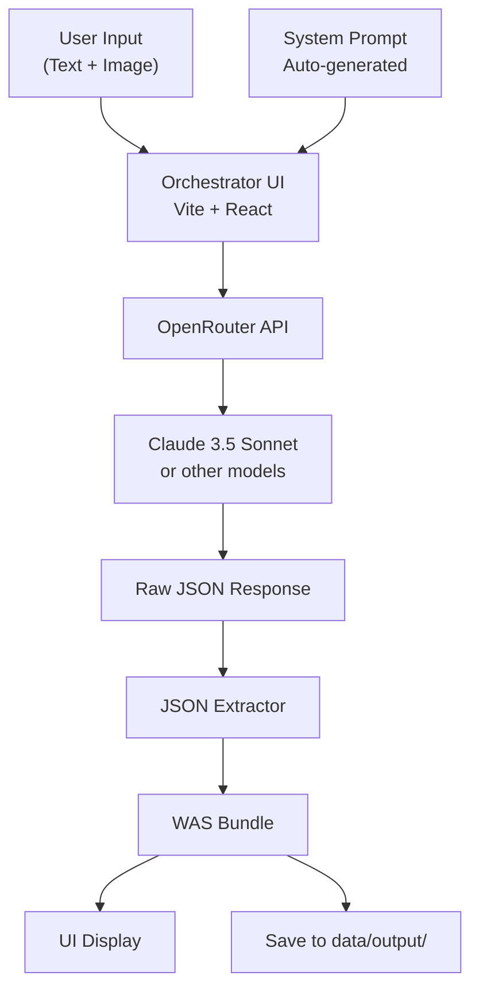

# Phase 02 — Tooling & MVP Workflows

**Status:** In Progress (Core features complete, validation pending)
**Stack:** TypeScript, React, Vite, OpenRouter
**Previous Phase:** [Phase 01 - Foundations](phase_01_foundations.md)
**Next Phase:** [Phase 03 - The Second Link](phase_03_the_second_link.md)

---

## 1. Goal
Phase 01 established the **Data** (the taxonomy in TOML).
Phase 02 builds the **Engine** (the tooling) to make that data usable by humans and agents.

We are moving from a static knowledge graph to a dynamic **Aesthetic Operating System**.

### 1.1 Scope Adjustment
**Original Plan:** Supabase Edge Functions + Full Playground with CSS visualizer
**Actual Implementation:** Local orchestrator UI + OpenRouter integration
**Rationale:** Faster iteration, no backend complexity, immediate testability

---

## 2. Core Deliverables

### 2.1 Prompt Generator ✅ **COMPLETE**
**Location:** `tooling/src/generators/generate_prompt.ts`

**Features:**
- ✅ Template system with placeholders
- ✅ Extract L1-L4 data from TOML files
- ✅ Auto-generate orchestrator system prompt
- ✅ One-click workflow: `npm run generate:prompt`
- ✅ Validation of hardcoded examples against instance data
- ✅ Alphabetical sorting of L2/L4 for readability
- ✅ Rich descriptions from instance data

### 2.2 WAS Orchestrator UI ✅ **COMPLETE**
**Location:** `app/orchestrator-ui/`
**Stack:** Vite + React + TypeScript + OpenRouter

**Features:**
- ✅ Text input for design descriptions
- ✅ Image upload (click, drag-drop, paste from clipboard)
- ✅ Model selector (Claude 3.5 Sonnet, Opus, Haiku, GPT-4)
- ✅ System prompt auto-loading with file watcher
- ✅ Real-time bundle generation via OpenRouter API
- ✅ JSON output with copy-to-clipboard
- ✅ Save/download bundles to `data/output/`
- ✅ Quick summary display of key bundle attributes
- ✅ Example prompt templates
- ✅ Robust JSON extraction (handles markdown, extra text)

**Documentation:**
- ✅ Complete README with setup instructions
- ✅ .env.example for API key configuration

### 2.3 The WAS Engine (TypeScript SDK) ⚠️ **INCOMPLETE**
**Planned but not yet built:**

- [ ] **TOML/JSON Converters**
  - `toml_to_json`: Parse TOML bundles to JSON
  - `json_to_toml`: Serialize JSON bundles to TOML

- [ ] **Bundle Validator** (Critical for Phase 3)
  - Zod schemas matching `site_bundle_schema.toml`
  - Validate style/lexicon IDs exist in instances
  - Logic checks (required axes, valid enums, weight ranges)
  - Integration with orchestrator UI

- [ ] **Schema Flattener** (Deferred to Phase 4)
  - Resolve L2 styles into L1 axes
  - Apply weighted inheritance
  - Handle trend → style → axis cascade

### 2.4 Testing & Validation ⚠️ **INCOMPLETE**

- [ ] **Manual Testing Suite**
  - Test with varied design descriptions
  - Verify bundle validity
  - Check enum compliance

- [ ] **Example Shots** (Waiting on user input)
  - Gold standard bundles for calibration
  - Few-shot learning examples

- [ ] **Consistency Testing** (Future)
  - Run same input 10x, measure variance
  - Target: >80% consistency

---

## 3. Architecture

### 3.1 Current Architecture (Built)

### 3.2 Planned Architecture (Phase 3+)

---

## 4. Success Criteria

### 4.1 Phase 02 Completion Criteria

**CORE (Required for Phase 03):**
- [x] ✅ Prompt generator working
- [x] ✅ Orchestrator UI generates valid WAS bundles
- [x] ✅ System can process text and image inputs
- [ ] ⚠️ Bundle validator implemented
- [ ] ⚠️ TOML/JSON converters working

**STRETCH (Deferred to Phase 04):**
- [ ] Visual bundle preview
- [ ] Live CSS/Tailwind visualizer
- [ ] Supabase deployment
- [ ] Schema flattener

### 4.2 Phase 02 is "Complete Enough" When:
1. ✅ User can describe a design idea in the orchestrator
2. ✅ System generates a valid WAS bundle JSON
3. [ ] **Bundle validator confirms output matches schema** ← **Critical blocker for Phase 03**
4. ✅ Bundles can be saved/downloaded for further use

**Current Status:** 3 of 4 criteria met. Need bundle validator before proceeding to Phase 03.