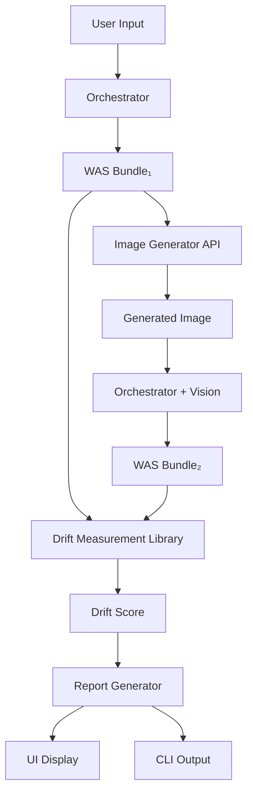

# Phase 03 — Drift Measurement & System Validation

**Status:** Planned
**Prerequisites:** Phase 02 (Orchestrator UI working)
**Previous Phase:** [Phase 02 - Tooling](phase_02_tooling.md)

---

## 1. Goal

Phase 02 delivered a working orchestrator that translates user intent into WAS bundles. Phase 03 validates the **entire system's fidelity** through round-trip aesthetic translation.

**Core Question:** When we go `Input → Bundle₁ → Image → Bundle₂`, how much information is preserved?

**Success = Low Drift:** Proving that WAS can reliably capture and reconstruct aesthetic intent.

---

## 2. Problem Statement

The WAS ecosystem involves multiple transformations:

```
User Input (text/image)
    ↓
WAS Orchestrator (LLM)
    ↓
WAS Bundle₁ (JSON schema)
    ↓
Image Generator (DALL-E, Midjourney, etc.)
    ↓
Generated Visual
    ↓
Vision-Enabled Orchestrator (LLM with vision)
    ↓
WAS Bundle₂ (JSON schema)
```

**Each step introduces potential information loss.**

### 2.1 What Drift Measures
- **Schema Expressiveness:** Can WAS capture the aesthetic?
- **LLM Consistency:** Does interpretation vary run-to-run?
- **Visual Fidelity:** Does rendering preserve aesthetic information?
- **Round-Trip Stability:** Can we reconstruct the original design?

### 2.2 Why This Matters
- **Low drift = high confidence** in all system components
- **High drift = problem exists** but cause is ambiguous (needs diagnosis)
- **Drift tracking over time** shows system improvement/degradation

---

## 3. Core Deliverables

### 3.1 Drift Measurement Library
**Location:** `tooling/src/drift/`

**Core Functions:**
- `measureDrift(bundle1, bundle2): DriftScore` - Main scoring function
- `analyzeDriftByLayer(bundle1, bundle2): LayerBreakdown` - Detailed analysis
- `generateDriftReport(bundle1, bundle2): Report` - Human-readable output

**TypeScript Interfaces:**
```typescript
interface DriftScore {
  total: number;              // 0.0 - 1.0 (1.0 = perfect)
  breakdown: {
    critical_invariants: number;
    ordinal_axes: number;
    categorical_axes: number;
    style_similarity: number;
    trend_similarity: number;
    lexicon_preservation: number;
  };
  violations: string[];       // List of critical failures
}

interface DriftReport {
  score: DriftScore;
  interpretation: string;     // "Excellent" | "Good" | "Moderate" | etc.
  recommendations: string[];
  layer_analysis: LayerBreakdown;
}
```

### 3.2 CLI Tool
**Command:** `npm run measure-drift`

**Usage:**
```bash
# Single comparison
npm run measure-drift bundle1.json bundle2.json

# Batch testing
npm run measure-drift --batch test-cases/*.json

# With baseline variance
npm run measure-drift --with-baseline bundle1.json bundle2.json
```

**Output:**
```
Drift Measurement Report
========================
Total Drift Score: 0.78

Breakdown:
  ✓ Critical Invariants:    0.75  (1 violation)
  ✓ Ordinal Axes:           0.85  (Good)
  ✗ Categorical Axes:       0.67  (Color strategy drifted)
  ✓ Style Similarity:       0.80  (Minor shifts)
  ✓ Trend Similarity:       0.90  (Excellent)
  ✗ Lexicon Preservation:   0.40  (Poor - investigate)

Interpretation: MODERATE DRIFT
Recommendations:
  - Investigate lexicon term extraction (L3)
  - Color strategy needs attention
  - Overall system is functional but needs tuning

Critical Violations:
  - density: "airy" → "dense" (inversion detected)
```

### 3.3 Test Suite
**Location:** `tooling/tests/drift/`

**Test Categories:**

1. **Known Perfect Cases** (5 tests)
   - Same bundle compared to itself
   - Expected drift: 1.0 (perfect match)

2. **Controlled Variation** (10 tests)
   - Single axis changed
   - Expected drift: 0.85-0.95

3. **Moderate Drift** (10 tests)
   - Multiple non-critical changes
   - Expected drift: 0.65-0.85

4. **Critical Failures** (5 tests)
   - Lightness flips, contradictions
   - Expected drift: < 0.60

### 3.4 Integration with Orchestrator UI
**New Feature:** "Test Drift" mode

**Workflow:**
1. User generates Bundle₁ from text/image
2. UI calls image generation API (DALL-E, etc.)
3. Generated image fed back to orchestrator
4. UI generates Bundle₂ from image
5. Display drift score and breakdown
6. Show side-by-side bundle comparison

**UI Components:**
- `<DriftTester>` - Main testing interface
- `<DriftScoreDisplay>` - Visualization of scores
- `<BundleComparison>` - Side-by-side JSON diff
- `<DriftHistory>` - Track measurements over time

---

## 4. Technical Architecture



### 4.1 Scoring Algorithm
See [Drift Measurement Playbook](../../playbooks/DRIFT_MEASUREMENT.md) for detailed algorithm.

**High-Level:**
```python
drift_score = (
    0.30 × critical_invariants +
    0.20 × ordinal_axes +
    0.20 × categorical_axes +
    0.15 × style_similarity +
    0.10 × trend_similarity +
    0.05 × lexicon_preservation
)
```

### 4.2 Variance Baseline
**Problem:** LLMs have inherent variance. Need to separate "expected variance" from "drift."

**Solution:** Run control tests
```
Same Input → Bundle₁
Same Input → Bundle₂
Measure: baseline_variance = 1 - drift(Bundle₁, Bundle₂)
```

**Reporting:**
```
Round-trip drift:     0.78
Baseline variance:    0.92  (8% variance)
Additional drift:     0.78 - 0.92 = -0.14 (14% additional loss)
```

---

## 5. Implementation Plan

### 5.1 Tier 1: MVP (Week 1-2)
**Goal:** Working drift measurement CLI

**Tasks:**
1. ✅ Create drift measurement library structure
2. ✅ Implement critical invariant detection
3. ✅ Implement ordinal/categorical scoring
4. ✅ Implement vector similarity (styles, trends)
5. ✅ Build CLI tool
6. ✅ Create 10 test cases (5 perfect, 5 varied)
7. ✅ Validate scores feel "right"

**Deliverable:** `npm run measure-drift` works for manual testing

### 5.2 Tier 2: Production (Week 3-4)
**Goal:** Robust testing and reporting

**Tasks:**
1. ✅ Implement batch testing
2. ✅ Add statistical analysis (mean, std dev)
3. ✅ Create variance baseline measurement
4. ✅ Build human-readable report generator
5. ✅ Expand test suite to 30 cases
6. ✅ Document interpretation guidelines

**Deliverable:** Automated drift measurement pipeline

### 5.3 Tier 3: UI Integration (Week 5-6)
**Goal:** Drift testing in orchestrator UI

**Tasks:**
1. ✅ Add "Test Drift" mode to UI
2. ✅ Integrate image generation API
3. ✅ Build drift visualization components
4. ✅ Add bundle comparison view
5. ✅ Implement drift history tracking
6. ✅ Create dashboard for drift monitoring

**Deliverable:** End-to-end drift testing in web UI

### 5.4 Tier 4: Advanced (Future)
**Goal:** Diagnostic and monitoring tools

**Tasks:**
- Ablation testing framework
- Component-level diagnosis
- Model comparison tools
- Continuous drift monitoring
- Alert system for drift degradation

---

## 6. Success Criteria

Phase 03 is complete when:

1. ✅ **CLI tool works:** Can measure drift between any two bundles
2. ✅ **Test suite passes:** 30 test cases validate scoring accuracy
3. ✅ **Baseline established:** Know what "good" drift looks like
4. ✅ **UI integration:** Users can test drift in orchestrator
5. ✅ **Documentation:** Clear guidelines for interpreting scores

**Validation Test:**
```
Given: User describes "Dark glassmorphism dashboard"
When: System generates Bundle₁ → Image → Bundle₂
Then: Drift score should be > 0.75 (Good or better)
```

---

## 7. Dependencies

### 7.1 Technical
- Phase 02 orchestrator working
- Image generation API access (DALL-E, Midjourney, etc.)
- Vision-enabled LLM (Claude 3.5 Sonnet, GPT-4 Vision)

### 7.2 Data
- WAS schema (Layer 1-4) finalized
- TOML instance data complete
- Generated system prompt working

### 7.3 Resources
- API credits for image generation
- API credits for vision-enabled LLM calls
- Development time: ~6 weeks

---

## 8. Risks & Mitigations

| Risk | Impact | Mitigation |
|------|--------|------------|
| **High baseline variance** | Drift scores unreliable | Use multiple runs, report confidence intervals |
| **Image API rate limits** | Slow testing | Implement caching, batch processing |
| **Scoring feels wrong** | Loss of confidence | Human calibration phase, adjust weights |
| **Drift too high overall** | System not viable | Layer decomposition, component diagnosis |
| **Model updates break baselines** | Scores drift over time | Version control baselines, re-calibrate |

---

## 9. Metrics & KPIs

### 9.1 Development Metrics
- Test coverage: > 90%
- Test suite pass rate: 100%
- Calibration accuracy: Human agreement > 85%

### 9.2 System Health Metrics
- Mean drift score across test cases: > 0.75
- Baseline variance: < 15%
- Round-trip additional drift: < 20%

### 9.3 Monitoring Metrics (Post-Launch)
- Weekly drift measurements
- Trend analysis (improving/degrading)
- Model-specific drift comparison

---

## 10. Future Enhancements

**Not in Phase 03, but worth considering:**

1. **Semantic similarity:** Use embeddings for `reasoning_notes` comparison
2. **Intent keyword overlap:** Measure metadata drift
3. **Multi-model testing:** Compare drift across Claude, GPT-4, etc.
4. **Automated optimization:** Use drift scores to tune prompts
5. **User feedback loop:** Let users rate bundle quality, correlate with drift
6. **Version tracking:** Monitor drift as schema evolves

---

## 11. Deliverables Checklist

- [ ] Drift measurement library (`tooling/src/drift/`)
- [ ] CLI tool (`npm run measure-drift`)
- [ ] Test suite (30 cases minimum)
- [ ] Documentation (this file + playbook)
- [ ] Baseline variance measurements
- [ ] UI integration (Tier 3)
- [ ] Interpretation guidelines
- [ ] Human calibration results

---

**Next Phase:** TBD (Could be visual rendering, production deployment, or agent workflows)

**Related Documents:**
- [Drift Measurement Playbook](../../playbooks/DRIFT_MEASUREMENT.md)
- [Phase 02 - Tooling](phase_02_tooling.md)
- [Validation Rules](../../playbooks/VALIDATION_RULES.md)
